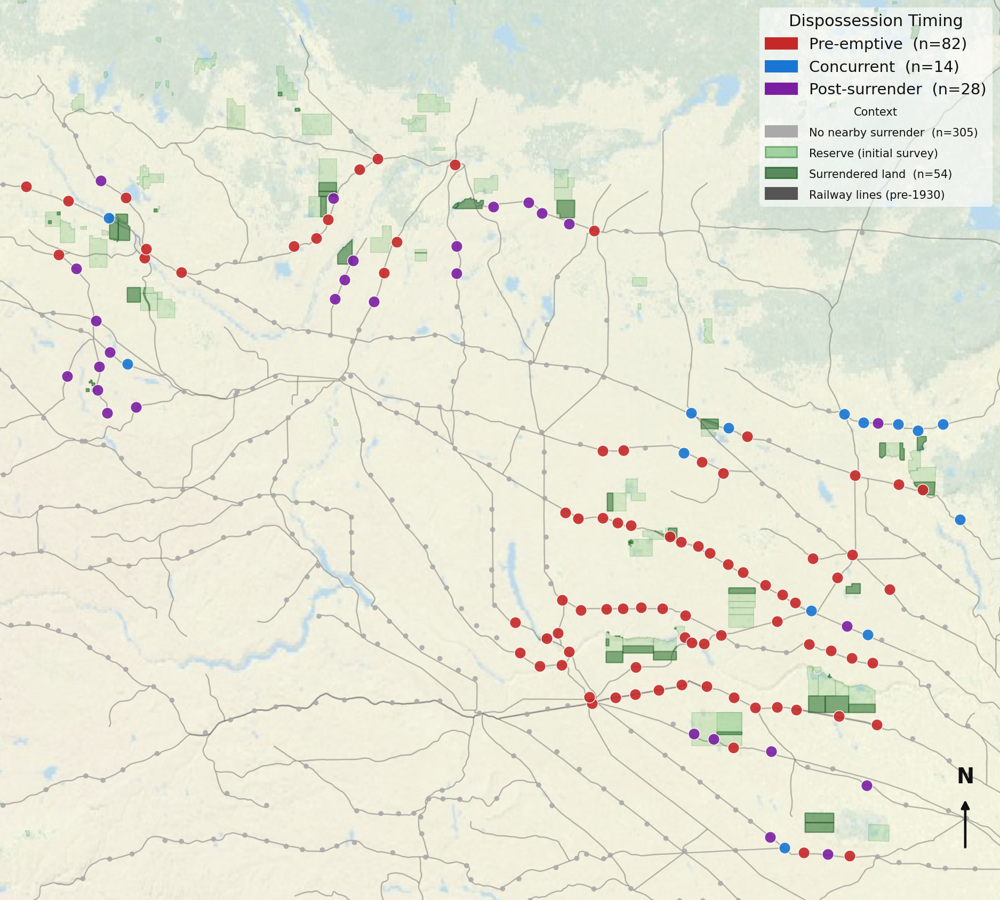
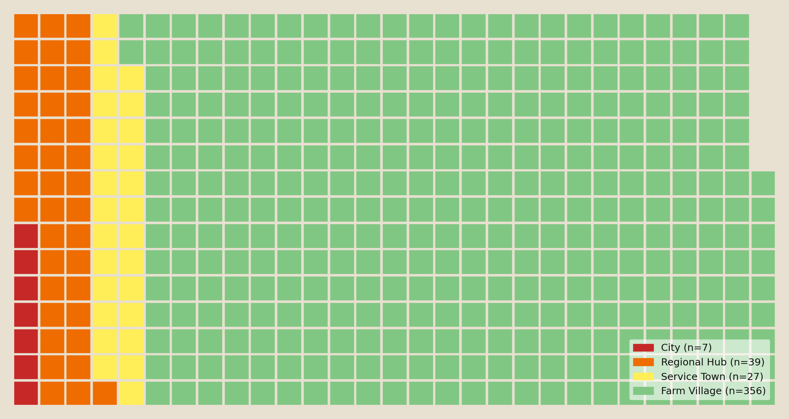
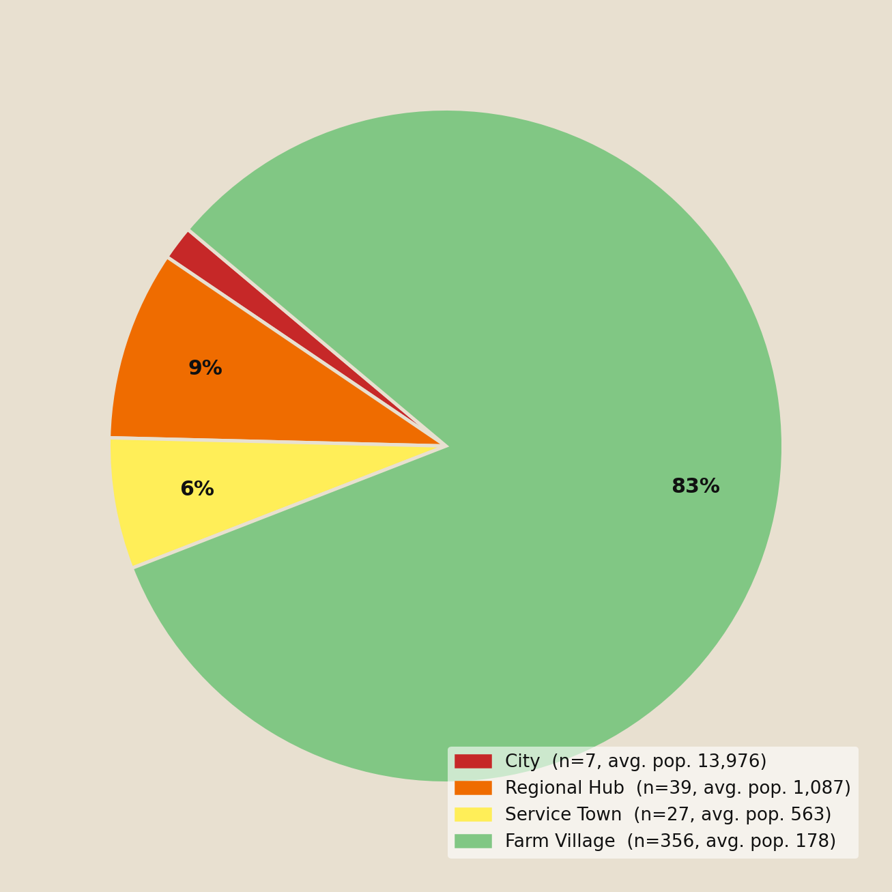
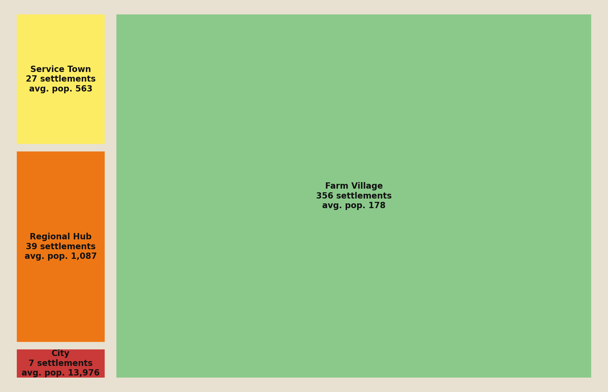
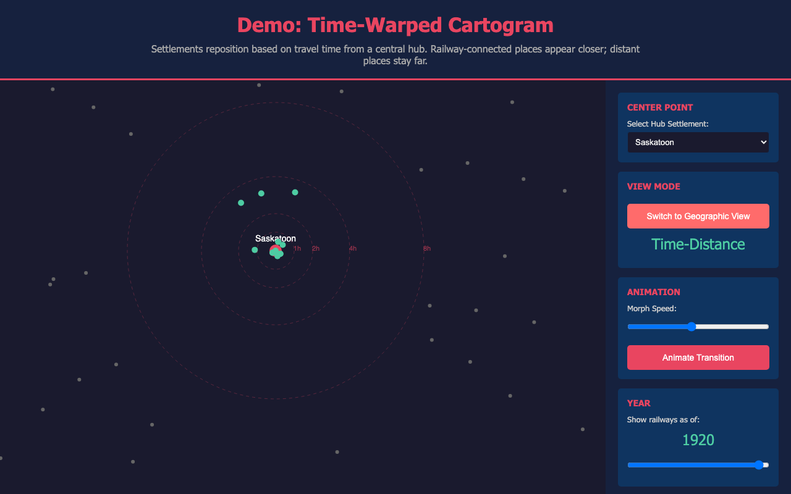
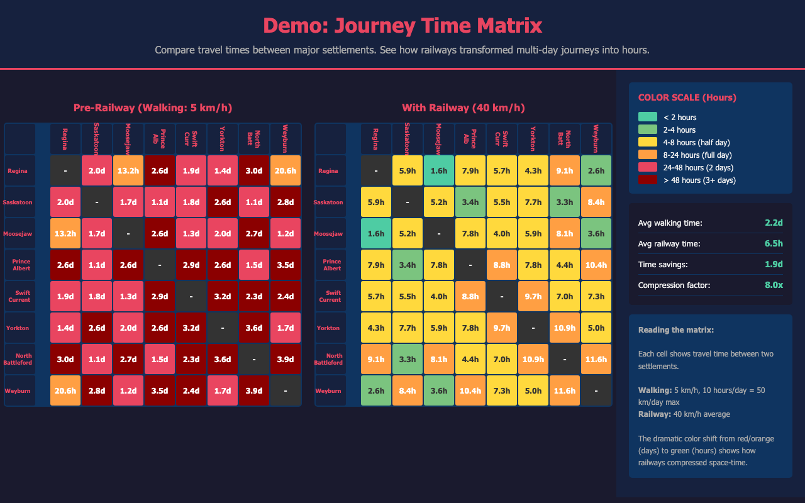

## Introduction

Agentic coding LLMs have changed what is tractable for historians without a technical background. Working in plain English prompts, a researcher can describe a problem, bring data into a shared workspace, and analytically iterate through data visualizations without writing a line of code. When I began to grapple with my thesis work in January of 2026, I had three datasets that needed to speak to each other: a census-derived knowledge graph, a historical railway GIS dataset, and reserve surrender records. Bringing those datasets into genuine conversation would otherwise have required either data engineering skills I did not have or the time to acquire them, resources a Master's student cannot spare. A few years ago, that constraint would have curtailed the questions I could explore. What I discovered over the months that followed was that this access did not just lower the barrier to starting my work: it redirected where the analytical work happened. The effort that would otherwise have gone into programming went into the history instead, into forming questions, interrogating outputs, and pushing the analysis further than the tool would have taken it on its own.

This process was rooted in the summer before my MA program started. I was given a bare-bones spreadsheet based on the 1921 census GIS shapefile containing the names of Saskatchewan's 429 urban municipalities, and I set out to document their establishment. Over three months in archives and local history collections, I compiled information for 409 of those communities: the chronology of each place, its colonial apparatus, its network infrastructure, and its institutions. The resulting spreadsheet was re-joined to its originating shapefile as part of the Mapping Settler Colonialism project's Story Map. What I did not fully recognize at the time was what I had built. That spreadsheet was a knowledge graph, a network of real-world entities linked by their relationships to one another. I was setting the stage for a process that would shape what I was able to ask of that data.

## The Constraints

Those three datasets presented three major constraints in using them to explore my research question, which was focused on the relationship between the establishment and growth of Saskatchewan's urban settler network and the dispossession of the province's Indigenous peoples from their lands between 1880 and 1921.

The first was cross-dataset translation. Each dataset was in a different format, at a different spatial and temporal scale, and built for a different purpose. The most interesting questions, about the relationship between railway expansion, commercial settlement structure, and Indigenous dispossession, required all of them in conjunction. Getting them to speak to each other required either someone with data engineering skills or a lot of my time.

The second was scale and speed. The research covered 429 municipalities across half a province over 50 years. Pattern recognition across the full dataset within a MA timeline was not feasible through manual analysis. Individual case studies were possible; the bigger picture was not.

The solution to these two constraints was to have a computational pipeline. Much of the work of bringing these datasets into conversation would have been made possible by writing code to do the data translation and math. But my background is in qualitative social sciences and I had not learned programming languages beyond some basic HTML. Thus the third constraint: my inability to write code. Acquiring that skill mid-degree would have meant directing the bulk of my analytical energy toward the technical problem rather than the historical one. The alternative was to rely on pre-built tools designed for other purposes, or to not attempt the question at all.

Bespoke visualizations proved invaluable for this research. The data was fundamentally spatial, recording relationships across geography and time, but represented in words and numbers that made those relationships invisible until mapped. GIS software could map the data, but this software limited the kinds of questions I could ask. What resolved all three constraints was an iterative visualization process built in collaboration with an LLM, colloquially known as AI. LLMs, even mid-tier models like Claude's Sonnet, are very good at data engineering and visualization using open-source code. This process made the coding barrier, the translation problem, and the scale problem all tractable at the same time.

## The Process

Claude Code is a coding LLM that runs in a terminal window. Working with it looks like a conversation: you describe a problem or a question in plain English, it responds in plain English alongside code, a script, or a draft visualization, and you react to what it produces. That reaction — what works, what's missing, what the output reveals that you did not expect — drives the next prompt. That cycle is the basic unit of the work.

My first session with Claude Code began with two datasets and a straightforward question. I said, "I have my knowledge graph and the Historical Canadian Railroads GIS data, and I want to understand how they connect. Can you help me see that?" Claude Code wrote scripts that created visual representations of Saskatchewan's railway network and the urban municipalities it serviced, complete with dates for the railway's arrival at each place and which company serviced it. Within a few days, I created an early iteration of what became my One Hour Railway Corridor visualization, which is a map showing how far a person could travel by rail in an hour from any given settlement. Using Claude Code, I created the visualization and learned to push it to GitHub where I could share the interactive visualization online with my supervisor and colleagues. I have lived in Saskatchewan my whole life and have experienced its distances but seeing them in railway time rather than driving time shifted my thinking. The settler mythology I had internalized about individual lone pioneers making their rugged living on the prairies started to give way to something more structural: these places were not isolated. They were nodes in a network, and the network had a shape.



What followed over the next several months was an iterative process structured around variations of that same question. Each session began with a dataset, a relationship between datasets, or a formed research question. Each session ended with a prototype, a refined question, a decision to abandon an approach, or a recognition that the data pointed somewhere more interesting than the original question had assumed. It was a speedy, cumulative workflow. Being able to test an idea within a session rather than across weeks changed which ideas were worth testing. A question that might have been set aside as too ambitious or too uncertain became worth pursuing when the time cost of trying it was an afternoon rather than a month.

The census data entered the process when the railway and settlement visualizations raised a question I could not answer with those datasets alone. The settlements were clearly connected, but what were they, exactly? The census called them "urban municipalities," but I wanted to interrogate that label. What if it was just opaque bureaucratic language for a collection of farms with a post office and a church nearby? How do we know these were genuinely urban places? That question required the census occupational data to test. Those tests led to the Economic Hierarchy Map, which displayed all 429 settlements coloured by their commercial functions, which in turn led to the economic typology that became a central framework of my research. The process had not just refined a question, it had generated a new foundational one and pulled in new data to answer it.

The role of Claude Code in the process was not to analyze the data or produce conclusions. It was to co-design the tools: translating research questions into technical specifications, parsing between datasets in incompatible formats, identifying what a cross-dataset visualization would require, and flagging when a proposed approach would be misleading rather than illuminating. Working with this tool over months of iteration helped me produce a particular kind of familiarity with the data. Not the deep expertise of a historian who has spent years with a single dataset and can recite its contents from memory, which is a valuable and different kind of knowledge. Instead, I developed a strong familiarity with the connections between datasets and the potential of those datasets in combination. I discovered what questions the combination of the census, the railway data, and the knowledge graph could bear, and what kinds of answers the intersections between them were likely to produce.

Part of what built that familiarity was learning, over time, where Claude Code's own approaches fell short. Explaining my research to an LLM that understood the data's structure but not its historical context forced me to articulate my implicit assumptions and to challenge them. But as the work accumulated, I also began to recognize the assumptions the tool made, the shortcuts it took, and the questions it was likely to miss. Catching those required going deeper into the underlying data myself, understanding it well enough to identify when an output was technically correct but historically misleading. The dialogue was analytical work on my part, and that work was possible because I was not spending my energy on coding.

This was further shaped by model choice. Throughout this project I worked primarily with Claude Sonnet, Anthropic's mid-tier model and the most cost-effective option available through a Pro subscription (\$20 USD / \$30 CAD per month). Sonnet is more prone to easy but incorrect solutions. As I worked within these constraints, I had to interrogate outputs more closely and maintain a critical eye. Using the Pro subscription also meant adapting to its usage limits. Rate limits and session caps made it necessary to be deliberate about how sessions were structured: what to ask, in what order, and how best to make use of the tool. That rigour became part of my methodology.

## What the Process Made Possible

What that iterative process produced, across months of sessions, was a different order of questions, ones that required holding all three datasets in view at once and asking what their intersections showed.

The Economic Hierarchy Map was a major output that answered one question while generating several more. Displaying all 429 settlements coloured by their commercial functions, it showed that the 'urban municipality' label was not bureaucratic convenience: the settlements fell into four distinct commercial tiers, visible across the province. Visualizing settlements by their tiers also showed that they were not evenly distributed across the settlement network; there were clusters of similar settlement types in unexpected places. This suggested that tiers did not solely emerge from the needs of settlers in the area, but instead hinted at other forces that I continued to explore through iterative analysis. That typology became a central framework of my analysis. It was not just a confirmation that these were genuinely urban places, but a new vocabulary for asking what differentiated them from one another.



Another instance came from limitations in existing data. The railway's geography had been thoroughly documented, but I could not find information on its impact on settlement density or distribution. In exploring this question with the LLM, we created a visualization with two modes: geographic and force-directed. The network graph offers a toggle between a geographic view, where settlements appear at their actual coordinates, and a force-directed network view, where settlements are positioned by their connection density. That toggle made my question visible. In network view, eight settlements emerged as multi-railway junction nodes with significantly higher connection density. While some, like the province's cities, were more obvious, other smaller junctions like Nokomis and Biggar were less so. These structural patterns became questions worth investigating because they became visible.



Understanding how the railway network was built across the province required seeing the progress itself, not the results of that progress. That required data in motion, so I created the railway network timeline. It is a year-by-year animation of the province-wide network from 1882 to 1920, with a bar chart showing the number of settlements added each year. This made it possible to ask about the network as a sequence of events rather than a fixed fact. When did each company's expansion accelerate? Where did the infill happen, and when? An animated map showed me new questions about the process through which these things happened.



The last example came from a question at the heart of my research. As part of the Mapping Settler Colonialism project, my colleagues Ashley Rabbitskin and Julian Rioux had mapped First Nations reserve surrenders in Saskatchewan. I wanted to know if there was a relationship between the urban network I had discovered and those surrenders. Overlaying the reserve surrender data onto the settlement and railway data made the relationships between them visible in a new way. What that overlay showed was a pattern that no singular dataset could have demonstrated: surrendered parcels were not distributed evenly across the province but clustered in proximity to railway lines and within the reach of the commercial network. That observation did not constitute a finding; it constituted a question worth testing rigorously. The visualization was the instrument that made the question visible enough to pursue.

## What the Failures Made Clear

Not every prototype worked. Three categories of failure proved methodologically useful for a reason specific to this process: when the cost of trying something is low, the cost of failing is low too. In each case, the visualization did what I asked of it. Recognizing it as a failure required the historical judgment that the output itself could not supply.

Early in the process, I built three visualizations to show the distribution of the 429 settlements across the four commercial tiers: a pie chart, a waffle chart, and a treemap. All three were discarded. The problem was that they reduced the data to proportions, a representation that obscured my research question. I was exploring where settlements were, when they were founded, and what was around them. All three visualizations removed geography and with it removed my questions. Knowing that quickly was itself a research outcome.

::: {layout-ncol=3}

:::

*Figures 6a–c: three discarded proportional views of the four-tier distribution. Each removed geography, and with it the spatial questions the research was built to ask.*

Another aspect I was pursuing was the compression of space and time offered by the railway and its contribution to that urban settlement network. A proposed time-warped map would have distorted physical geography so that settlements close together by railway travel time appeared spatially close, regardless of their actual distance. The concept was compelling, but this data was not visually valuable. By distorting Saskatchewan's geography, even I found myself struggling to orient myself within the data and understand what it was demonstrating. It was not a distortion borne of a useful analytic insight, but one that changed spatial reference points without offering a practical alternative. Legibility is a functional requirement for a research tool, not a design preference.

And sometimes the failure was in the approach rather than the question. I wanted to explore travel time between settlements to understand how connections between communities could have worked in this era. I attempted a heatmap showing travel times between all 429 settlements by walking, horse cart, and railway. At any scale where individual cells were readable, the matrix was too large to fit on screen; at any scale where it fit, individual cells were invisible. The aggregate view collapsed the individual variation that made the question worth asking. Building in the capacity for nuance with an instrument that could examine one connection at a time made that variation available for analysis.

## Conclusion

Historians are not ignorant of computational methods. What has kept many from exploring them is not interest nor access to digital data, but the gap between having a question and being able to usefully test it. This paper has argued that LLM-supported iterative visualizations are one method to help close this gap. This approach does not mean offloading the analytical work: the questions worth testing remain ours to identify and the failures remain ours to diagnose.

What this process showed me is that the skepticism and professional rigour that AI requires are not a caveat. They are the method. Learning where the tool fell short also helped me to identify my own knowledge gaps, and going deeper into the data to compensate was where much of my historical thinking happened. The value of this process has not been in the answers it suggested, but in the questions it allowed me to ask.

## About the Author

Jessica Jack is a Master's student in the Department of History at the University of Saskatchewan. With a previous M.A. in medical anthropology, Jessica sought to apply her qualitative research skills to historical research and discovered an unexpected synergy with digital history, including mapping through HGIS and the emerging world of LLM-supported methodologies. Her research focuses on how settler colonialism in late 19th and early 20th century Saskatchewan was shaped by the conversion of prairie Indigenous territory into private property, and the impacts of that process on Indigenous dispossession in the province.

## Code and Data Availability

The live visualizations are embedded above and are also published as standalone interactive pages at [jjax07.github.io/Sask_Railway_Visualizations](https://jjax07.github.io/Sask_Railway_Visualizations/). The data and code that drive them are vendored in this paper's repository (`data/` and `code/`) so that this archived version is self-contained.

### Datasets

***Saskatchewan Urban Municipalities Knowledge Graph.*** Compiled by the author in the summer of 2025. Documents 13 categories of establishment information for 409 of the 429 urban municipalities classified in the 1921 census. Joined to the originating 1921 census GIS shapefile produced by the Canadian Historical GIS Project under Dr. Geoff Cunfer, and published as part of the Mapping Settler Colonialism project's Story Map.

- Data file: [`data/JJack_USask_Urban_Muni_Knowledge_Graph_2026.csv`](data/JJack_USask_Urban_Muni_Knowledge_Graph_2026.csv) (this repository)
- Canadian Historical GIS Project shapefile: <https://hgiscanada.usask.ca/download>
- Mapping Settler Colonialism Story Map: <https://storymaps.arcgis.com/stories/8288eb9615484e708922e81411e63936/>

Primary sources: more than 200 community-written local history books, accessed at the Saskatoon Public Library's Local History Room, the University of Saskatchewan Archives and Special Collections, and the University of Calgary's Local Histories digital collection.

- Full source list: <https://jjax07.github.io/Sask_Community_Sources/>
- University of Calgary Local Histories: <https://digitalcollections.ucalgary.ca/Browse/Collections/Local-Histories>

Supplementary sources:

- Find a Grave: <https://www.findagrave.com>
- Saskatchewan Cemeteries Project: <https://saskgenweb.ca/cansacem/>
- Library and Archives Canada Post Offices and Postmasters dataset: <https://library-archives.canada.ca/eng/collection/research-help/postal-heritage/pages/post-offices-postmasters-canada.aspx>
- Peel's Prairie Provinces Newspapers Database: <https://www.library.ualberta.ca/peel/newspapers>
- Saskatchewan Historic Newspapers Online: <http://pasnewspapers.usask.ca/>

***Historical Canadian Railroads GIS Dataset.*** Produced by the GEORIA Project, University of Toronto.

- doi:10.5683/SP2/UCCFVQ — <https://doi.org/10.5683/SP2/UCCFVQ>

***Reserve Surrender Records.*** Compiled by Ashley Rabbitskin and Julian Rioux as part of the Mapping Settler Colonialism project at the University of Saskatchewan. Documents 54 First Nations reserve surrenders in Saskatchewan, including dates, acreage, and treaty area designations. Not independently published.

- Mapping Settler Colonialism Story Map: <https://storymaps.arcgis.com/stories/8288eb9615484e708922e81411e63936/>

### Code

All cross-dataset parsing, joining, and visualization scripting was performed through iterative sessions with Claude Code. Scripts were written in Python. The data-preparation and network-building scripts are in [`code/`](code/); the interactive visualization source files are published at the [Sask_Railway_Visualizations repository](https://github.com/jjax07/Sask_Railway_Visualizations).

### Computational Resources

All agentic coding work was performed using Claude Code (Anthropic), accessed via a Pro subscription. Sessions ran between January and June 2026. The primary model throughout was Claude Sonnet; sessions from January through February 16, 2026 used claude-sonnet-4-5, and sessions from February 17, 2026 onward used claude-sonnet-4-6. No high-performance computing resources were used; all processing ran on a consumer laptop.

### Data Limitations

The knowledge graph covers 409 of the 429 urban municipalities in the 1921 census; the 20 missing communities lack sufficient archival documentation.

The Historical Canadian Railroads GIS dataset had 272 discrepancies with the knowledge graph's original railway data. 261 were resolved by cross-referencing; 11 remain unresolved (Lebret, Macoun, Morse, Hudson Bay Junction, Sutherland, Rosthern, Weyburn, Warman, Pangman, Mazenod, Lockwood). The dataset does not include the M&NW (Manitoba & North Western Railway); settlements on that line rely on the original research data. Travel time calculations in the One Hour Railway Corridor visualization use 40 km/hour as a proxy for branch line speeds, which varied in practice.

The reserve surrender dataset documents all 54 recorded First Nations reserve surrender parcels in Saskatchewan across 42 reserves, covering surrenders completed by 1933, spanning Treaties 4, 5, 6, and 10.
